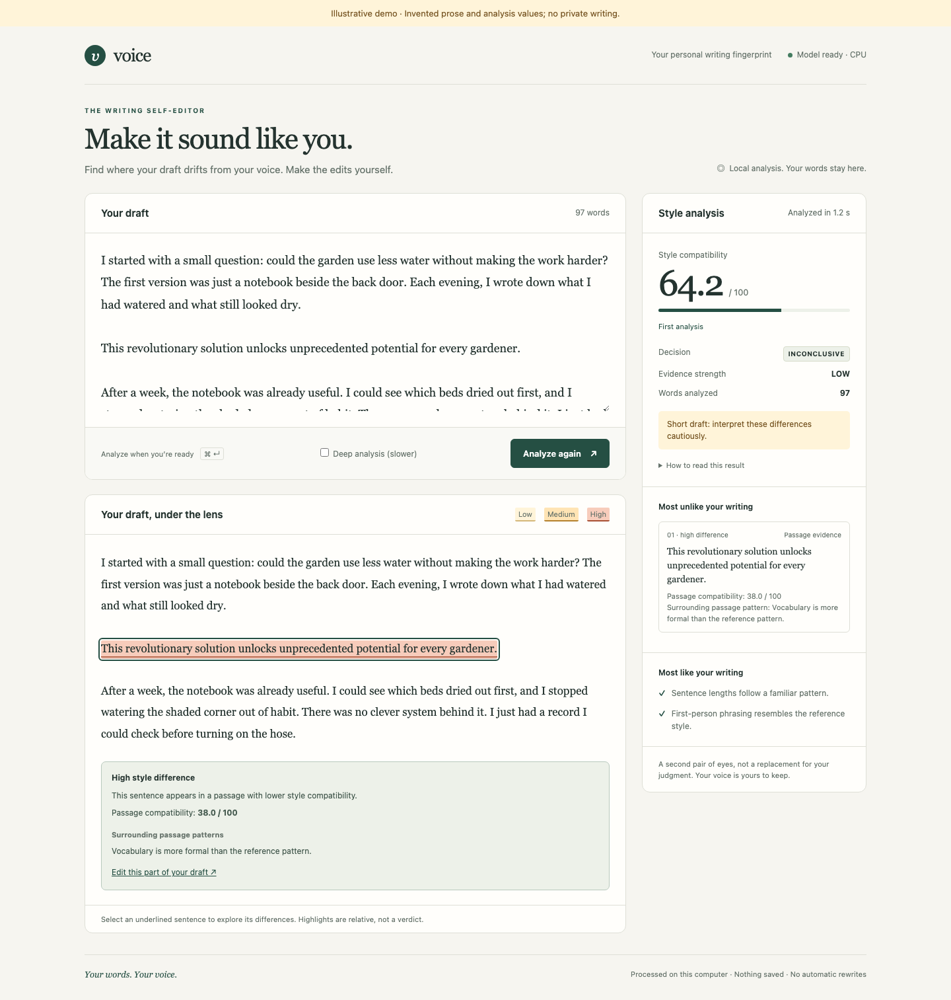

# Personal writing style fingerprint

This tool compares a draft with things you've written before to help you understand how it fits your style. You build a local fingerprint from historical posts and optional private email examples, then use it to score new prose and inspect the differences. You'll get a **0–100 style compatibility score**, explanations, and historical passages you can read alongside the draft.

There's also a browser editor where you can select highlighted sentences, make your own edits, and analyze another version. You might use it to check an email or see how a longer post compares with older posts. The model won't rewrite anything for you. Keep topic, genre, and text length in mind when interpreting results. You shouldn't treat the score as an authorship probability, forensic proof, or an AI detector.

I've described the pinned LUAR encoder, 95 stylometric measurements, and character 3–5 gram TF-IDF comparison in the [implementation guide](docs/implementation.md). You can follow the steps below to install the tool, build a fingerprint, and try it on your own writing.

## Install

You'll need Python 3.11 or newer. I've verified Python 3.13 and recommend it:

```sh
python3.13 -m venv .venv
source .venv/bin/activate
python -m pip install -e '.[test]'
```

If you'd like to benchmark the optional supervised boosting model, install the extra dependencies:

```sh
python -m pip install -e '.[supervised]'
```

LightGBM needs an OpenMP runtime on macOS. If LightGBM can't load, you'll get a warning and the tool will evaluate logistic regression instead. Run these commands from the project directory. The first evaluation or build downloads the pinned LUAR checkpoint, roughly 2.5 GB, including custom code at its pinned revision. After that, inference is local. Weights and generated output are ignored by Git.

## Evaluate, build, score, explain

```sh
python -m style_fingerprint evaluate
python -m style_fingerprint build
python -m style_fingerprint score tests/fixtures/candidate.txt
python -m style_fingerprint explain tests/fixtures/candidate.txt
python -m style_fingerprint score new-email.txt --input-format email
```

Replace `new-email.txt` with your own file. Here are a few additional options:

```sh
python -m style_fingerprint build --device cpu --offline
python -m style_fingerprint build --corpus blog_posts --artifacts artifacts
python -m style_fingerprint evaluate --seed 42 --holdout-fraction .2
python -m style_fingerprint score --text "I think this is an interesting experiment."
python -m style_fingerprint explain candidate.md --json
python -m style_fingerprint evaluate --json
```

If you've already downloaded the checkpoint, you can run offline. You can choose CPU or let automatic device selection prefer CUDA, then MPS, then CPU. On macOS, CPU inference uses one worker thread to avoid native OpenMP crashes. If you want a quick result, use score. If you'd like more detail, use explain or JSON output. Replace `candidate.md` with your draft. You'll get explanations in JSON too, and errors return a nonzero exit status.

## Local writing self-editor

If you'd rather work in a browser, you can start the local editor after building the production fingerprint and caching the encoder:

```sh
python -m style_fingerprint serve
```

Open the local page at `http://127.0.0.1:8000` and paste your draft. Choose **Analyze style**, then select an underlined sentence to see its measured differences. You can edit in the draft box and choose **Analyze again**, or press Ctrl/Cmd + Enter, to compare with the previous score. You'll do the rewriting yourself.



*This is the actual page with invented prose and example analysis values. It doesn't show model validation results.*

Keep the server local because it has no authentication. Your draft isn't logged, saved, sent elsewhere, or included in artifacts. Browser results clear when you refresh. You won't need a frontend build or external assets, and you can submit up to 50,000 Unicode characters. If you want another port or saved fingerprint, use `--port 8080` or `--artifacts PATH`.

You can change [the packaged page](style_fingerprint/web/index.html) directly. You'll get FAST analysis by default, and you can select **Deep analysis** for bounded sentence-deletion checks. The [self-editor specification](docs/specification.md#local-writing-self-editor) explains highlights and API behavior.

## Python API

You can also load the fingerprint and score a draft from Python:

```python
from style_fingerprint import StyleFingerprint

fp = StyleFingerprint.load("artifacts")
result = fp.score("Your draft goes here...")
print(result.score, result.decision, result.evidence_strength)
print(result.match_threshold, result.mismatch_threshold)
print(result.largest_mismatches)
print(result.anomalous_passages)
```

If you're building through Python, evaluation is the default mode. Select production mode to refit using frozen choices (`build_mode='production'`). When scoring, you can select email input for email cleaning (`input_format='email'`) or turn explanations off to skip passage and deletion explanations (`explain=False`). I've described production and holdout handling in [evaluation](docs/evaluation.md).

## Evaluation report preview

If you'd like to see the evaluation results, open the HTML report (`artifacts/report.html`). You'll get a summary first, and you can expand Technical details when you want to look closer. I've explained the metrics and historical holdout in the [report guide](docs/evaluation.md#reading-the-report).


*This is the actual report layout with invented metrics and counts. These aren't results from the corpus.*

## Corpus and rebuilds

Add independent posts to the blog directory (`blog_posts/`) and authored emails to your configured private directories. Once you've added them, evaluate and build again. You shouldn't join separate messages just to make a longer example. I've put discovery and cleaning in the [corpus guide](docs/corpus.md), with views, weighting, and caching in the [specification](docs/specification.md).

Keep private prose, filenames, IDs, exact splits, and excerpts out of Git. Generated output stays in the artifacts directory (`artifacts/`), downloaded weights in the cache directory (`.cache/`), and the unused prototype stays ignored. Don't load a fingerprint you don't trust because it uses Python/joblib serialization.

## Optional negative corpus

For negative examples, you can use comparable technical AI/ML posts and emails from other authors. Give each author a stable ID and keep the source attribution with their writing. You'll be able to pass a negative directory to build (`build --negative-corpus PATH`) or use the automatically discovered sibling directory. Downloaded bodies belong in ignored local negative inputs (`negative_posts/local/`). You shouldn't assume that something you can read publicly is licensed for redistribution.

You'll find eligibility, sample requirements, licenses, and [blind synthetic curation](docs/negative-corpus.md#blind-synthetic-curation) in the [negative corpus guide](docs/negative-corpus.md). Private or untracked ancestry keeps descendants private, and synthetic diagnostics stay separate. If you change the negatives, you'll need to evaluate and build again. MVP v1 stays frozen. Further model changes need new independent writing.

## Understanding results

When you get a result, start by reading the highlighted passages before deciding what to change. You can try an edit and compare with your previous score. You're looking at style similarity, not proof of authorship or AI generation. Topic and genre can affect the result too. If deep analysis shows a score change after removing a sentence, you've learned something about sensitivity, not causation.

You'll get MATCH, INCONCLUSIVE, or MISMATCH using learned thresholds. When there isn't a supported lower threshold, anything below MATCH is INCONCLUSIVE_OR_MISMATCH. Don't assume that 50 means a match. You'll also get LOW evidence below 150 usable words, MEDIUM from 150–499, and HIGH from 500. Disagreement between components can lower that rating. You need at least three usable words, and HIGH doesn't establish identity.

If you want to understand the calibration and report, see [evaluation](docs/evaluation.md). The visible metrics estimate the whole selection process through nested grouped evaluation. Production uses frozen development choices. The historical holdout doesn't select anything, but it's already been inspected and isn't fresh evidence.

## Development and documentation

You can run the tests and documentation checker with:

```sh
python -m pytest
python -m pytest -m integration tests/test_integration.py
python scripts/check_docs.py
```

You won't need model downloads for the default tests because they replace only the encoder boundary. For the opt-in integration test, you'll need the cached real checkpoint and it'll run on CPU. Write failing behavioral tests before changing behavior, then make them pass. Keep generated metrics and transcripts in ignored artifacts. I've kept one maintained [verification note](docs/development.md) and a [documentation index](docs/README.md) for the specification, architecture, score math, and privacy rules.

### Apple Silicon and fast editing

If you're running on Apple Silicon, you'll want native arm64 Python and PyTorch. You can check the installation with:

```python
import platform
import torch
print(platform.machine())
print(torch.backends.mps.is_built())
print(torch.backends.mps.is_available())
```

You should see `arm64`, `True`, and `True` in a compatible setup. Start the server with automatic device selection:

```sh
python -m style_fingerprint serve --device auto
```

You can use the same device option for build and evaluate. Auto prefers CUDA, then MPS, then CPU. If you explicitly request MPS and it isn't available, you'll get an error. Don't enable `PYTORCH_ENABLE_MPS_FALLBACK`, because unsupported GPU operations should fail clearly. If the page says CPU, check your native Python and PyTorch installation, MPS availability, and the device option.

You'll see the actual device in the readiness indicator. The server warms the GPU encoder before it's ready so you don't pay that startup cost on your first request. Embeddings run on the GPU, while stylometry and logistic regression stay on CPU. GPU batches default to 16 and CPU batches to 4. There's one GPU out-of-memory retry with the batch reduced from 16 to 8, and results keep the original input order.

You'll get FAST analysis by default: document scoring, passage evidence, measured deviations, and reference comparisons. It doesn't remove and rescore sentences. If you want that extra work, select **Deep analysis (slower)**. It checks up to twenty sentences in three passages. You'll see the request duration with your result.

The analysis API accepts fast or deep mode and returns the mode and timing. The health API reports the actual device, precision, and embedding batch size. See the [performance specification](docs/specification.md#native-gpu-performance-and-interactive-analysis) for the exact fields and runtime behavior.

If you've already built a fingerprint, you can move its single-precision encoder from CPU to MPS without rebuilding. Changing numerical precision needs more care. You'll need to evaluate again and rebuild the reference embeddings when you change precision. Half precision is still an explicit experiment, not the default. I've kept the acceptance gates, cache rules, and latency targets in the [performance specification](docs/specification.md#native-gpu-performance-and-interactive-analysis).

If you'd like to see how it runs on your machine, you can benchmark it with:

```sh
.venv/bin/python scripts/benchmark_style.py --precision-experiment
```

You'll get warm timing comparisons for 300, 1,000, and 2,000 words, using the CPU and available Apple GPU precision options with both analysis modes. Loading, downloading, and warm-up are left out. You can read the local results in ignored performance artifacts (`artifacts/performance/benchmark.json`). The benchmark refreshes reference vectors and scores frozen examples with the same fitted verifier. It doesn't select a model, train it, or change your defaults. If you want to change tokenization, profile it first and only remove duplicate work when it accounts for at least 5% of fast-analysis latency.
