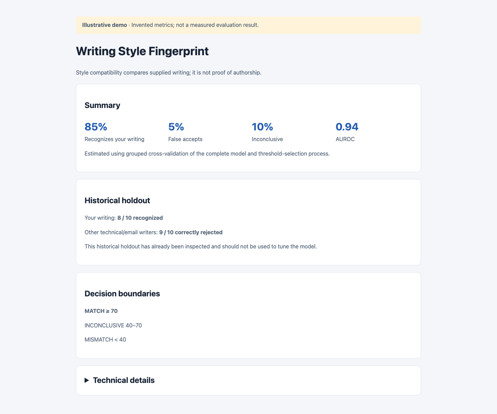

# Grouped development evaluation and frozen production configuration

Evaluation selects model behavior from development data. Production refitting applies those frozen choices to approved writing. The already inspected holdout remains historical evidence and must never guide feature, threshold, weighting, segmentation or hyperparameter changes.

## Split policy and isolation

The seeded historical split targets at least half the blog inventory, rounded up, and at least three blogs where available; other positive sources and negatives target 20%, rounded up. Independent roots, known negative authors and connected duplicate-prose groups stay together. Seed 42 is the default. Sorted inventories and fixed seeded assignment ensure repeatability. Exact role identities and corpus hashes remain in ignored artifacts. Cross-label duplicate prose fails rather than implying clean attribution.

Every training view retains its permanent root identity. Positive roots and known negative authors define validation groups. No validation root enters fitted rows, character vocabulary, reference statistics, reference passages, normalization or calibration. Calibration receives one median out-of-fold margin per root, regardless of view count. Missing validation predictions are omitted, never replaced by in-sample predictions. Nested calibration/model-selection folds also preserve group isolation.

Generating more correlated views cannot increase independent sample counts. Known negative authors receive equal total influence, divided among their roots and views; positive roots receive equal total document influence. Supervision needs ten independent negative roots, at least three known negative authors when reliable author metadata exists, and enough independent positive groups for calibration. Otherwise the existing reference-similarity fallback remains explicit; operating thresholds and decisions cannot be calibrated without adequate negatives, so the result reports unavailable thresholds and INCONCLUSIVE_OR_MISMATCH.

## Model and threshold selection

Compare logistic regression and optional LightGBM using identical grouped development predictions. Prefer logistic regression unless LightGBM improves AUROC by at least 0.02 and does not materially worsen TPR at 5% FPR. Length metadata does not enter the classifier. Document predictions aggregate view margins by median before calibration.

Choose the match threshold to maximize genuine-writing acceptance under development false acceptance at most 5%. If the target cannot be met, choose the lowest attainable false acceptance and best positive acceptance within it, and report the limitation. Choose a lower mismatch threshold targeting false rejection at most 5% when data supports two thresholds. Use a distinct supported score cutoff; floating-point neighbors cannot create a meaningful inconclusive band. Scores between them are INCONCLUSIVE; sparse-data fallback below the match threshold is INCONCLUSIVE_OR_MISMATCH. Compatibility remains a 0–100 style scale, never authorship probability.

## Negative contrast and development ablations

Only human-authored other-author email bodies and technical AI/ML blogs are eligible negatives. Python PEPs, formal specifications, RFCs, standards, API/reference documentation and unrelated genres are excluded throughout training, calibration, evaluation, reference banks and reports. Preserve stable root/author identity and `source_type` (`email` or `technical_blog`); source labels and identities are diagnostic/grouping metadata, never predictor features. Email cleanup retains newly authored prose only. Author diversity matters more than raw document count.

Use the existing encoder and symmetric multi-vector comparison for one similarity per negative author. Add user embedding similarity, best and median negative-author similarities, and user-minus-best and user-minus-median gaps. Validation roots/authors are absent from negative banks and every fitted state. Hard roots derive only from grouped development OOF scores: union of scores at/above match threshold and highest-scoring 10% of negatives. An author is hard if any root is hard or author median reaches mismatch threshold.

Compare only four development configurations: baseline, baseline plus contrast, contrast plus hard-author weighting, and contrast without character predictors. Ordinary authors have total weight 1; the weighting candidate gives hard authors 2, preserving root/view balancing. Select weighting or character removal only when TPR at 5% FPR improves without AUROC declining more than 0.01 or recognition declining more than 0.03; weighting must also avoid calibration degradation. Logistic regression remains preferred under the existing challenger rule. Character measurements may remain explanatory diagnostics when classifier predictors are removed. Historical holdout never selects these choices.

Changing eligible negative inputs invalidates frozen selection and supervised artifacts. Rebuild views, banks, vocabulary, features, verifier, calibration, thresholds, predictions and production state; only valid embeddings for unchanged text may be reused. Results from the former PEP population remain historical and are not directly comparable with current performance.

## Usage and artifacts

```sh
python -m style_fingerprint evaluate --json
python -m style_fingerprint build --device cpu --offline
python -m style_fingerprint score tests/fixtures/candidate.txt
python -m style_fingerprint explain tests/fixtures/candidate.txt
```

Evaluation writes frozen `evaluation_config.json`, metrics in `evaluation.json`, identifier/metric-only `evaluation_predictions.parquet`, and standalone `report.html`. Production build consumes the frozen model, schema, segmentation, calibration and threshold configuration without reselecting them. If configuration is absent, build explicitly announces automatic initial evaluation. The production fingerprint may incorporate approved historical holdout roots; doing so does not create a fresh independent benchmark.

A permanently excluded holdout manifest supports future sealed data. Designate genuinely new historical positives and negatives as `holdout_v2` before inspection. Pass `--holdout-manifest PATH` to evaluation; the JSON object uses `{"holdout_v2": ["generic-document.md", "negative/generic-author/post.md"]}` with local root IDs. The designation persists across later evaluations and builds in that artifact directory; connected duplicate and author groups are excluded too. `build --exclude-historical-holdout` keeps consumed historical test roots excluded from production as an explicit alternative.

These roots never train the verifier, reference fingerprint or calibrator, nor select model, features or thresholds. Consumed documents cannot become a genuinely new holdout by reshuffling.

## Reading the report



*The screenshot uses invented metrics and counts to show the report layout. Read your locally generated `artifacts/report.html` for actual results; the image is not benchmark evidence.*

The default HTML shows Summary, Historical holdout, Decision boundaries and optional Watch-outs, followed by collapsed Technical details. The four development summary values are recognition, false acceptance, inconclusive percentages and AUROC. Holdout emphasizes recognized/rejected counts. Visible thresholds are rounded; exact values remain in technical details. Training fit, nested selection, TPR at 1%, 5% and 10% FPR, average precision, Brier error, model/source tables and root/view counts are collapsed.

At most three difficult authors appear visibly. Technical tables show at most twenty authors sorted by false acceptance then median compatibility, and ten difficult development OOF roots. Complete diagnostics remain in `evaluation.json` and the one-row-per-root `evaluation_predictions.parquet`. Prediction rows identify development OOF versus historical holdout and record metadata, components, negative-author contrast, margin, compatibility, decision and hard status without prose. Source type supports separate email/technical-blog document counts, author counts, median compatibility and false acceptance; it is never a classifier feature.
Small datasets cannot support precise false-acceptance guarantees. Related correspondence, sparse source subsets, topic/genre confounding and unknown encoder pretraining membership limit generalization claims. More untouched independent writing is more valuable than more views of consumed roots. Model snapshots and retrieval excerpts remain private ignored artifacts; public documentation does not enumerate private input identities. See [specification](specification.md), [corpus handling](corpus.md) and [development verification](development.md).

The four visible summary cards use nested grouped model and threshold-selection metrics, estimating the complete selection process. Selected configuration OOF performance remains a diagnostic in collapsed Technical details. The single additional ablation compares hard-negative-weighted contrast with and without character predictors on identical development folds; historical holdout is informational only. See the [current specification](specification.md) for materiality thresholds and the frozen feature decision.

Nested outer-fold thresholds are selected from inner OOF scores for that fold’s selected configuration, using outer training labels only. Outer predictions retain margins, scores, decisions, fold IDs and both frozen thresholds in evaluation.json and evaluation_predictions.parquet (split `nested_outer`). Aggregate operating metrics use recorded decisions; ranking and calibration diagnostics use combined scores. Full-development selected-configuration OOF scores still determine production thresholds. Technical details report fold threshold ranges and warn when the match range exceeds 15 compatibility points; unsupported mismatch cutoffs remain unavailable.

## Lessons from iterative document editing

The README editing exercise used the saved production fingerprint and unchanged thresholds. It established that iterative rewriting can move a complete Markdown document into MATCH. It did not establish that the resulting document reliably represents the author's voice: the final crossing was narrow, and the document had been repeatedly inspected and optimized against the same scorer. Exact scores, candidate snapshots and confirmation evidence remain in ignored `artifacts/readme-style/`. This is an editing case study, not independent model validation or a reason to change the frozen production configuration.

### What the revisions suggest about the author's style

Direct explanations addressed to the reader, contractions and sentences that connect an action to its purpose were useful directions for this README. Dense, impersonal specification prose was less compatible. Consolidating repeated rules and linking to the maintained guides also made the document easier to read. Adding first-person language alone did not consistently help; pronoun substitution is not a reliable recipe for the author's voice.

The reference measurements suggested that semicolons were uncommon, while the original README used them heavily. Later drafts still used commas and “or” more frequently than the reference median. These are useful review prompts, not quotas or proof that particular words should be removed. Signed feature contributions describe the fitted classifier's associations; they do not establish the causal effect of an edit. A small wording change happened to produce the final threshold crossing, but that does not demonstrate a special author preference for that wording.

These observations apply to this task and reference collection. The revisions also changed length, repetition, paragraph structure and the distribution of technical material. Documentation differs from much of the historical writing, so genre and content may explain part of the improvement. Preserve factual completeness and natural phrasing rather than trying to reproduce reference feature averages.

### Why passage advice and document scores can disagree

In supervised mode, the whole-document score calibrates the median verifier margin across the full text and selected paragraph windows. The anomalous-passage list evaluates a different set of chunks. Consequently, rewriting the lowest-ranked passage may leave the document score unchanged, and a better passage score does not guarantee a better document score. The reported verifier contributions come from a view nearest the median; whole-text feature deviations describe another scope. These explanations are hypotheses to test with a complete before/after score.

Window selection is deterministic for unchanged input, but it is not stable under editing. Changing words or paragraph boundaries can change the eligible window inventory and therefore the seeded selection. The full-document view is always retained, but its margin is only one input to the median. Some apparent improvements can therefore reflect different sampled content as well as different prose.

Markdown cleanup adds another source of mismatch between what a reader sees and what the model scores. Removed code and other markup can leave incomplete prose around technical examples. Make surrounding explanations readable on their own and inspect the cleaned input before interpreting a surprising result. FAST explanations retain the same compatibility calculation while avoiding the more expensive sentence-deletion analysis, making them suitable for routine editing.

### A more reliable editing approach

1. Freeze the model, thresholds, input format and runtime configuration. Save the starting text, its hash and complete score locally. Inspect cleaned prose and keep required facts, commands and links explicit.
2. Use passage rankings to choose a plausible revision, then measure its effect on the whole document. Keep a change only when it also improves readability or clarity without losing meaning. Retain the best acceptable draft so an unsuccessful trial can be reversed.
3. Set an editing budget before starting. Record attempted revisions, including unsuccessful ones, in ignored artifacts. Repeatedly searching for a threshold crossing can exploit scorer peculiarities; a MATCH after adaptive editing is not held-out evidence.
4. Confirm the exact saved file in a fresh process. Report its distance from the threshold alongside the decision. HIGH evidence describes the existing length and signal-agreement heuristic; it does not certify a stable threshold crossing or editorial quality.
5. Check sensitivity to harmless reflow and nearby, meaning-preserving edits. Treat a fragile MATCH as a limited result rather than continuing to optimize indefinitely. Select any formal robustness criterion using development data, not this inspected README or historical holdout.

### Improvements worth testing next

The most useful explanation improvement would be to expose the selected text ranges and their margins, showing which views determine the median and how they relate to highlighted passages. A cleaned-text preview and paired before/after diagnostics would make unexpected changes easier to understand. Label such comparisons as sensitivity measurements rather than causal explanations.

Before changing aggregation, test score sensitivity to paragraph reflow, punctuation, equivalent wording, code formatting and text lengths around the window-selection boundaries. Compare the current selection with stable coverage windows or a predeclared ensemble of windows. Evaluate repeatability across supported runtimes as well. These are proposals, not implemented behavior; changes to segmentation or preprocessing require behavioral tests first, versioned configuration and appropriate artifact invalidation.

For documentation editing, collect fresh, independently written documentation positives and comparable other-author negatives. Preserve root, author and duplicate-group isolation. Compare human edits with score-guided edits under a fixed budget, with reviewers assessing meaning, completeness and naturalness without seeing scores. Keep this optimized README out of independent validation. Use genuinely new sealed data for final assessment and development data for all model choices. This can distinguish improved author compatibility from genre recognition or successful optimization of one document, while retaining the existing local architecture.
